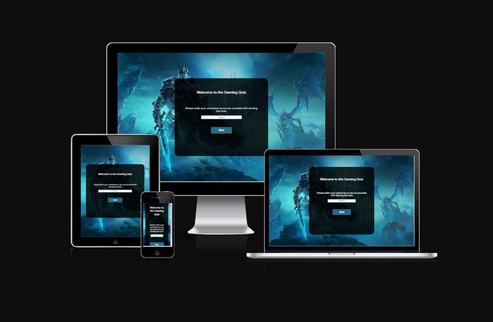
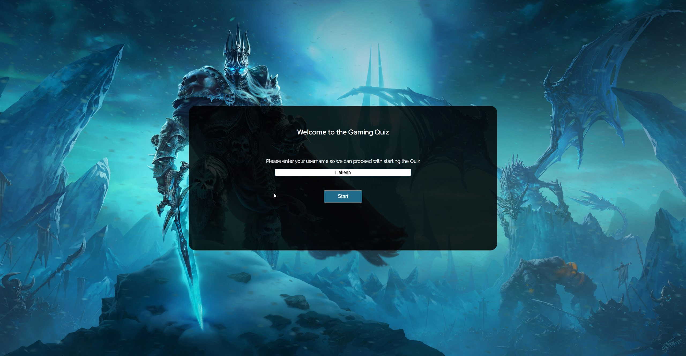
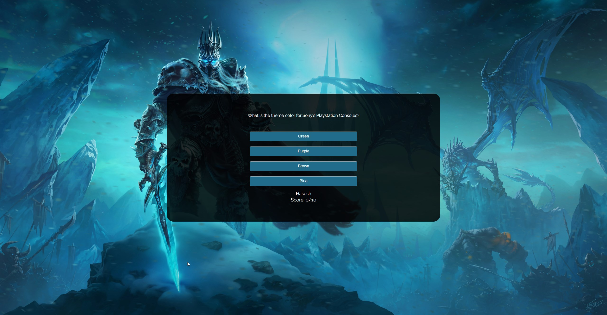
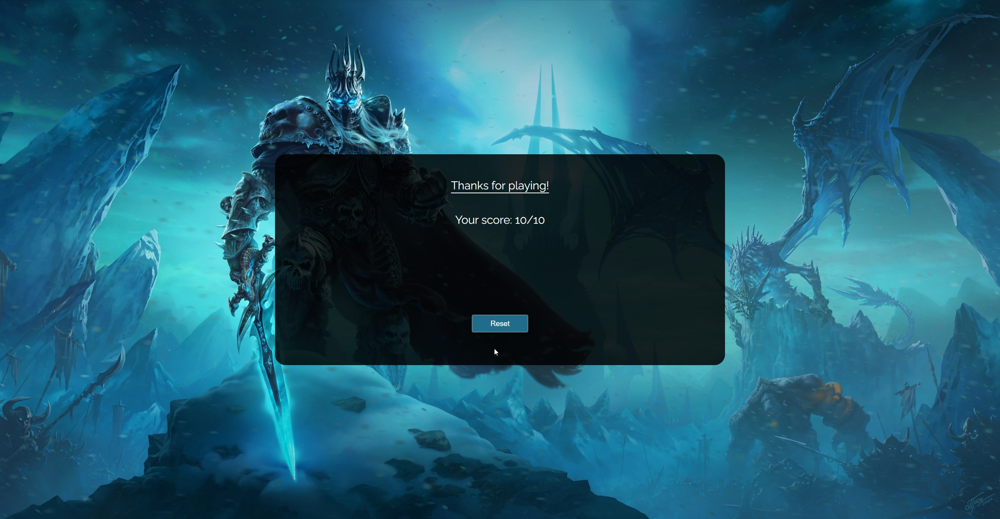
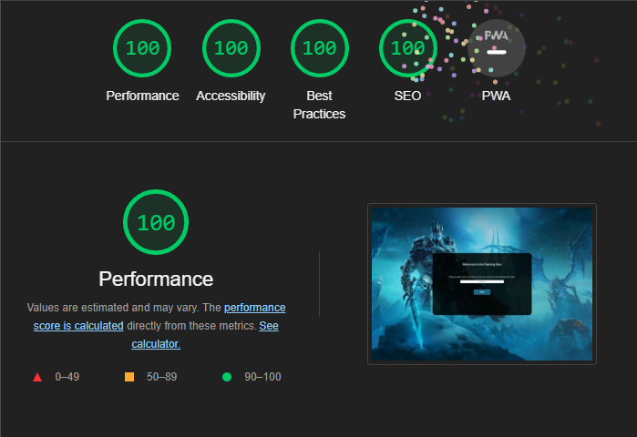

# Gaming Quiz

Gaming Quiz is a quick tool to help test users general gaming knowledge regarding certain brands, developers, publishers, games and the likes!

Users playing this game will get to test their knowledge while admiring the breath taking background image. It's a single webpage with an interactive window used for the quiz game.

[Gaming Quiz - Live Link](https://hakesh.github.io/p2-gaming-quiz/) (Right click to open in a new tab)

---

## CONTENTS

* [Features](#features)
  * [Landing Page](#landing-page)
  * [Quiz Game](#quiz-game)
  * [Final Score](#final-score)
  * [Future Implementations](#future-implementations)
  * [Accessibility](#accessibility)

* [Technologies Used](#technologies-used)
  * [Languages Used](#languages-used)
  * [Frameworks, Libraries & Programs Used](#frameworks-libraries--programs-used)

* [Deployment](#deployment)

* [Testing](#testing)

* [Credits](#credits)

---

## Features

### Landing Page
  - Features an incredible image of a famous 'World of Warcraft' villain, Arthas, The Lich King as the webpages background images that the users can admire as they play the quiz.
  - The easy and straight forward approach to the game will get them started quickly, and if they choose too short a name (or none at all) they will get clear instructions on what to do.

### Quiz Game
  - The quiz game has an easy on the eyes structure with the question at the top with 4 buttons as options to choose from, with their username and score count below the buttons. After the user presses one of the buttons it will either change color to red or green to indicated if its right or wrong, and a "next" button will appear below the score counter to progress to the next question.

### Final Score
  - A very basic scene with the users total score count from doing the quiz, and a thank you message for playing the game. Also a "reset" button to reset the game and start over from the beginning.

### Future Implementations

- Making the countdown actually count down on the page after the final question has been answered instead of just a static text.
- A more advanced scoring system.
- Make it more obvious when you select the right or wrong answer, whether it be some minor animation or sound effect.

### Accessibility

I've tried to make the website as accessible as possible where I could by:

- Using semantic HTML.
- Colors that are easy on the eye at any time of day.

## Technologies Used

### Languages Used

HTML, CSS and JS was used when making this website.

### Frameworks, Libraries & Programs Used

- Git - For version control.

- GitHub - To save and store the files.

- Visual Studio Code on Gitpod - My choice of IDE

- Google Fonts - To find and import fonts used for the website.

- Microsoft Edge Developer Tools - To troubleshoot, test features see and solve responsiveness, also to try get an understand why or how things were working, especially logging things to the console to see if things are doing or working the way they should.

- [Am I Responsive](https://ui.dev/amiresponsive) - To show the website on a wide range of devices.

## Deployment

Github Pages was used to deploy the website. The instructions to do this can be found below:

1. Log in or sign up to Github.
2. Find the repository for this project, [p2-gaming-quiz](https://github.com/Hakesh/p2-gaming-quiz).
3. Click on the "Settings" button in the menu bar for the repository.
4. Click on Pages in the left hand side navigation bar.
5. From the Source dropdown menu, select "Deploy from a branch".
6. From the Branch dropdown menus, select "main" and "/root" respectively.
7. Click Save. Your live Github Pages site is now deployed at the URL shown at the top of the page. **Keep in mind it might take a bit before the page is deployed and a URL is shown, you might have to refresh the page after a few minutes to get it to show.**

The live link can be found here - https://hakesh.github.io/p2-gaming-quiz/

## Testing

This website was developed using Microsft Edge with the use of Microsoft Edge Dev Tools, which have been used since the very beginning to troubleshoot this website for any problems that arose and to make sure the website was responsive on many different resolutions and devices. 

The website has also been tested in Google Chrome and it works as expected.

The lighthouse score perfect this time around.

My biggest hurdle was getting the name requirement to work without a form, it took a fair bit of trial and error and researching to get it to work in an okay way. I wanted to get/make a similar warning/alert that you get as if you were using the "required" attribute in a form, however not enough time was available to research this option.

### Validator Testing

- HTML
  - No errors were returned when passing through the official [W3C Validator.](https://validator.w3.org/nu/?doc=https%3A%2F%2Fhakesh.github.io%2Fp2-gaming-quiz%2F)

- CSS
  - No errors were found when passing through the official [(Jigsaw) Validator.](https://jigsaw.w3.org/css-validator/validator?uri=https%3A%2F%2Fhakesh.github.io%2Fp2-gaming-quiz%2F&profile=css3svg&usermedium=all&warning=1&vextwarning=&lang=en)

- JS
  - No errors were returned when passing the JS code through Jshint, only warnings (though not sure what most of them entail). [Jshint](https://jshint.com/)
  - Jshint Image link: https://i.imgur.com/Bh4y2z8.png 

### Lighthouse Testing

### Unfixed Bugs

- If you spam click the correct answer you are able to get an unlimited amount of points/score.
- For whatever reason the general quiz body is smaller on the live version, compared to the one designed on the IDE

## Credits

- [Web Dev Simplified](https://www.youtube.com/watch?v=riDzcEQbX6k)
  - Another one of his videos coming to my rescue. Wouldn't have been able to finish this project in time if it wasn't for him. A large amount of JS code is credited to him as the quiz game is based on his own, with other features being implemented by me (score count, end screen, name requirement, etc). 
  I only had 1.5-2 days of time on this project and wasn't able to figure out a solution by myself in time. Huge huge props to this guy.

- [Code Institute Template](https://github.com/Code-Institute-Org/gitpod-full-template)
  - My repository was created using the GitPod template given by Code Institute.

- [Stackoverflow](https://stackoverflow.com/questions/1191865/code-for-a-simple-javascript-countdown-timer)
  - Wasn't sure how to make a countdown timer and found this amazingly simple snippet from Ali in the thread linked that worked flawlessly. Just wish I was able to implement the actual countdown onto a text, but I wasnt able to get it to work in time.

- [W3schools](https://www.w3schools.com/)
  - No specific code snippet was used from them but they are an incredible resource for learning/helping/remembring that I will always feel a need to include them here as their explanations and examples have incredible value.

- [Blizzard](https://blizzard.gamespress.com/Wrath-of-the-Lich-King-Classic-Reveal)
  - For providing excellent images in their press-kit. This is where my stunning background image is coming from.

- [Google Fonts](https://fonts.google.com/)
  - Used for finding and using the fonts 'Antic' and 'Rajdhani'.

- Love Math Project
  - Some inspiration and learning from this project was carried over to this one.